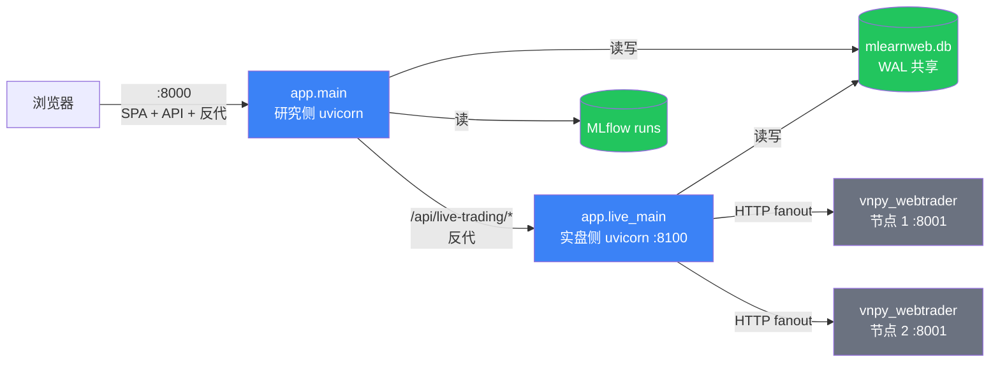

# mlearnweb

量化策略训练记录 + 实盘监控可视化平台。FastAPI (Python 3.11) 后端 + React/Vite 前端 + 多节点 vnpy webtrader HTTP 客户端。

研究侧展示 MLflow 训练记录、回测报告、SHAP 因子可解释性；实盘侧多节点 fanout 拉 vnpy 推理机的策略状态、IC 时序、TopK 历史预测、持仓 / 成交 / 除权事件。

## 顶层架构



**双进程**：研究侧 (8000) 与实盘侧 (8100) 独立 uvicorn，共享 SQLite (WAL)。研究侧负载 (SHAP / mlflow) 不会拖慢实盘 5 个 sync_loop 的轮询节奏；研究侧 `--reload` 不影响实盘状态。

**单端口生产部署 (Phase 4)**：浏览器只认 :8000，研究侧 mount 前端 `dist/` + 反代 `/api/live-trading/*` → :8100。无需 nginx / IIS。

**跨机部署**：mlearnweb 不读 vnpy 推理机任何本地文件 (Phase 3 解耦完成)，所有数据走 vnpy webtrader REST。`vnpy_nodes.yaml` 配 `base_url` 即可，多节点 fanout 自动合并。

## 快速开始

### 开发环境（双进程 + Vite dev）

```powershell
# 后端 — 两个独立窗口
cd mlearnweb\backend
python -m uvicorn app.main:app --port 8000 --reload          # 窗口 A
python -m uvicorn app.live_main:app --port 8100 --reload     # 窗口 B

# 前端
cd mlearnweb\frontend
npm install
npm run dev    # → http://127.0.0.1:5173
```

测试：

```powershell
cd mlearnweb
python -m pytest tests/test_backend/ -v
```

### 生产部署（Windows Server / 30 分钟）

详见 [docs/DEPLOYMENT_WINDOWS.md](docs/DEPLOYMENT_WINDOWS.md)。一句话：

```powershell
# 管理员 PowerShell
git clone <仓库> mlearnweb
cd mlearnweb\deploy
.\install_all.ps1 -DataRoot D:\mlearnweb_data
```

## 项目结构

```
mlearnweb/
  backend/                 FastAPI 双进程入口 (app.main / app.live_main)
    app/
      core/config.py       Settings (.env 驱动)
      models/              SQLAlchemy ORM (mlearnweb.db, WAL)
      routers/             HTTP 路由层 (含 _live_proxy.py 单端口反代)
      services/            业务逻辑层
        vnpy/              多节点 webtrader 客户端 + 5 个 sync_loop
      schemas/             Pydantic 请求/响应模型
    requirements.txt       Python 依赖
    .env.example           环境变量模板
    vnpy_nodes.yaml        vnpy 推理节点列表 (gitignore)
  frontend/                React 18 + Vite + antd
    src/pages/             页面 (按模块分目录)
    src/services/          API 客户端 (TS 类型化)
  deploy/
    install_all.ps1        一站式部署 (W4.4)
    install_services.ps1   NSSM 服务化 (research:8000 + live:8100)
    uninstall_services.ps1 卸载 (保留数据)
  docs/                    架构 / 部署文档
  tests/test_backend/      pytest 集成测试
```

## 文档索引

| 文档 | 内容 |
|---|---|
| [docs/mlearnweb-technical-design.md](docs/mlearnweb-technical-design.md) | 技术设计：技术栈 / 架构图 / 类图 / 主要功能原理 |
| [docs/DEPLOYMENT_WINDOWS.md](docs/DEPLOYMENT_WINDOWS.md) | Windows Server 30 分钟部署手册 |
| [docs/plan/mlearnweb-independent-deploy-roadmap.md](docs/plan/mlearnweb-independent-deploy-roadmap.md) | Phase 1-4 解耦 + 部署路线图 |

## 关键依赖

- Python 3.11+ (qlib + pandas + pydantic v2 下限)
- Node.js 18+ (Vite 5 / antd 5 LTS)
- NSSM (Windows 服务化, https://nssm.cc/)
- vnpy_webtrader 节点 (实盘数据源, 不强制 — 研究侧无 vnpy 也能跑)
