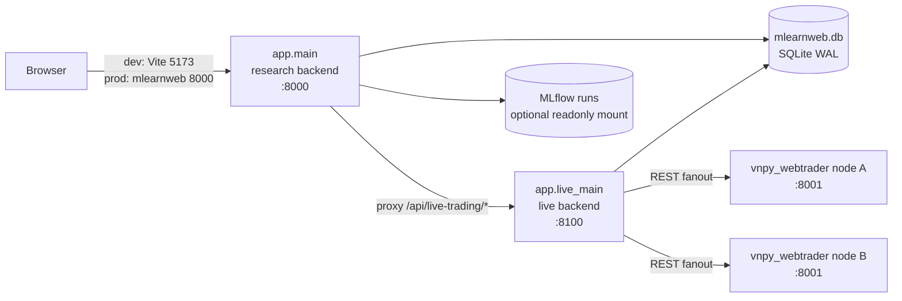

# mlearnweb

mlearnweb 是量化研究与实盘监控的 Web 平台，后端基于 FastAPI，前端基于 React/Vite。它在同一个界面里承载两类工作：

- 研究侧：浏览 MLflow 实验、训练记录、回测报告、因子文档与模型解释结果。
- 实盘侧：通过 vnpy webtrader HTTP 接口监控多节点策略、账户、持仓、成交、权益曲线和 ML 策略运行状态。

mlearnweb 不直接 import vnpy 模块。实盘数据通过 `vnpy_nodes.yaml` 中配置的 vnpy webtrader 节点获取，便于把 Web 平台和交易进程部署在不同机器上。

## Features

- 双后端进程：研究侧 `app.main` 和实盘侧 `app.live_main` 独立运行，共享 SQLite WAL 数据库。
- 单端口生产模式：研究侧进程可挂载前端 `dist/`，并反向代理 `/api/live-trading/*` 到实盘侧进程。
- 多 vnpy 节点 fanout：一个 mlearnweb 实例可汇总多台推理/交易节点。
- 实盘策略工作台：策略列表、详情页、权益曲线、指标总览、当前持仓、历史持仓、成交记录、ML 监控与运维操作。
- 研究工作台：训练记录、实验 run、报告、因子文档、SHAP/特征重要性等。
- Windows Server 一键部署脚本：`deploy/install_all.ps1` 负责依赖安装、前端构建、DataRoot 配置和 NSSM 服务化。

## Architecture



为什么拆成两个 uvicorn 进程：

- 研究侧可能读取大型 MLflow artifact、执行 SHAP/回测分析，容易出现秒级阻塞。
- 实盘侧负责策略轮询、快照写入和运维控制，需要独立事件循环，避免被研究侧任务拖慢。
- 两个进程共享同一份 SQLite，数据库启用 WAL，适合当前读多写少的监控场景。

## Requirements

| Component | Version | Notes |
| --- | --- | --- |
| Python | 3.11+ | 项目常用解释器：`E:\ssd_backup\Pycharm_project\python-3.11.0-amd64\python.exe` |
| Node.js | 18+ | Vite 5 / React 18 |
| npm | 9+ | 随 Node.js 安装 |
| Windows | Windows 10/11 或 Windows Server 2022 | 生产部署脚本按 Windows Server 设计 |
| NSSM | 2.24+ | 仅生产服务化需要 |
| vnpy webtrader | 可选 | 只使用研究侧时不需要；实盘侧需要至少一个节点 |

## Quick Start

### 1. Install Backend Dependencies

```powershell
cd mlearnweb\backend
py -3.11 -m venv .venv
.\.venv\Scripts\Activate.ps1
python -m pip install --upgrade pip
python -m pip install -r requirements.txt
```

如果在 `qlib_strategy_dev` 父仓库中开发，并且导入时报缺少 `qlib_strategy_core`，安装父仓库的 vendor 包：

```powershell
python -m pip install -e ..\..\vendor\qlib_strategy_core
```

### 2. Configure Environment

```powershell
cd mlearnweb\backend
Copy-Item .env.example .env
Copy-Item vnpy_nodes.yaml.example vnpy_nodes.yaml
```

最小开发配置通常只需要确认这些字段：

| Variable | Example | Purpose |
| --- | --- | --- |
| `DATABASE_URL` | `sqlite:///D:/mlearnweb_data/db/mlearnweb.db` | SQLite 数据库路径 |
| `UPLOAD_DIR` | `D:\mlearnweb_data\uploads` | 上传文件目录 |
| `FRONTEND_DIST_DIR` | `D:\apps\mlearnweb\frontend\dist` | 生产模式前端构建目录 |
| `VNPY_NODES_CONFIG_PATH` | `D:\mlearnweb_data\config\vnpy_nodes.yaml` | vnpy 节点清单 |
| `LIVE_TRADING_OPS_PASSWORD` | `<strong-password>` | 实盘写操作口令，生产必须设置 |
| `MLRUNS_DIR` | `D:\mlruns` | 可选，研究侧 MLflow runs 只读挂载 |
| `STRATEGY_DEV_ROOT` | `D:\apps\qlib_strategy_dev` | 可选，训练工作台/调参入口 |

开发时如果不配置 vnpy 节点，研究侧仍可运行；实盘页会显示节点缺失或离线。

### 3. Start Backend Services

打开两个 PowerShell 窗口：

```powershell
cd mlearnweb\backend
.\.venv\Scripts\Activate.ps1
python -m uvicorn app.main:app --host 127.0.0.1 --port 8000 --reload
```

```powershell
cd mlearnweb\backend
.\.venv\Scripts\Activate.ps1
python -m uvicorn app.live_main:app --host 127.0.0.1 --port 8100 --reload
```

### 4. Start Frontend

```powershell
cd mlearnweb\frontend
npm install
npm run dev
```

访问：

- 前端开发站点：`http://127.0.0.1:5173`
- 研究侧 API：`http://127.0.0.1:8000/docs`
- 实盘侧 API：`http://127.0.0.1:8100/docs`

## Production Deployment

Windows Server 推荐使用一键脚本：

```powershell
cd mlearnweb
.\deploy\install_all.ps1 -DataRoot D:\mlearnweb_data
```

脚本会完成：

- 创建 `DataRoot\config`、`DataRoot\db`、`DataRoot\uploads`、`DataRoot\logs` 等运行时目录。
- 创建 Python venv 并安装后端依赖。
- 安装 `vendor/qlib_strategy_core`。
- 安装前端依赖并执行 `npm run build`。
- 生成 `DataRoot\config\.env`，写入 `DATABASE_URL`、`FRONTEND_DIST_DIR`、`VNPY_NODES_CONFIG_PATH` 等路径。
- 安装两个 NSSM 服务：`mlearnweb_research` 和 `mlearnweb_live`。

部署完成后访问：

```text
http://<server-ip>:8000/
```

详细步骤、端口策略、防火墙和排错见 [docs/DEPLOYMENT_WINDOWS.md](docs/DEPLOYMENT_WINDOWS.md)。

## vnpy Node Setup

实盘侧通过 `vnpy_nodes.yaml` 发现交易节点。模板位于 [backend/vnpy_nodes.yaml.example](backend/vnpy_nodes.yaml.example)。

```yaml
nodes:
  - node_id: local
    base_url: http://127.0.0.1:8001
    username: vnpy
    password: vnpy
    enabled: true
    mode: sim
```

建议：

- vnpy webtrader 端口不要直接暴露公网。
- 跨机器部署时优先使用内网地址或 SSH tunnel。
- `mode` 用于前端区分 `sim`/`live` 节点，策略参数中的 gateway 命名仍有更高优先级。

## Common Commands

```powershell
# Backend tests
cd mlearnweb
python -m pytest tests/test_backend -q

# Frontend build
cd mlearnweb\frontend
cmd /c npm run build

# Deployment smoke test
cd mlearnweb
.\deploy\smoke_test.ps1 -PythonExe D:\mlearnweb_data\venv\Scripts\python.exe

# Stop production services
cd mlearnweb
.\deploy\uninstall_services.ps1
```

## Project Layout

```text
mlearnweb/
  backend/
    app/
      core/          Settings and runtime config
      models/        SQLAlchemy models and SQLite WAL setup
      routers/       FastAPI routers
      schemas/       Pydantic response/request models
      services/      Business logic, including vnpy client services
    requirements.txt
    .env.example
    vnpy_nodes.yaml.example
  frontend/
    src/
      pages/
      services/
      types/
  deploy/
    install_all.ps1
    install_services.ps1
    smoke_test.ps1
    uninstall_services.ps1
  docs/
    plan/
  tests/test_backend/
```

## Configuration Notes

- `.env` 属于启动配置；生产由 `MLEARNWEB_ENV_FILE` 指向 `DataRoot\config\.env`。
- 运行时轮询类配置可通过系统设置页或数据库覆盖，例如 `VNPY_POLL_INTERVAL_SECONDS`。
- `MLRUNS_DIR` 未配置时，研究页降级为空，不影响实盘监控。
- `STRATEGY_DEV_ROOT` 未配置时，训练工作台/调参入口禁用，不影响 dashboard 和 live-trading。
- `LIVE_TRADING_OPS_PASSWORD` 为空时写操作鉴权关闭，仅适合本地开发。

## Testing

推荐在每次 mlearnweb 功能变更后至少执行：

```powershell
cd mlearnweb
python -m pytest tests/test_backend -q

cd frontend
cmd /c npm run build
```

生产发布前还需要在干净 Windows Server 上执行：

```powershell
.\deploy\install_all.ps1 -DataRoot D:\mlearnweb_data
.\deploy\smoke_test.ps1 -PythonExe D:\mlearnweb_data\venv\Scripts\python.exe
```

## Troubleshooting

| Symptom | Check |
| --- | --- |
| 前端可以打开但实盘接口 502 | `mlearnweb_live` 是否运行，`/api/live-trading/*` 是否能访问 `127.0.0.1:8100` |
| 实盘节点离线 | 检查 `VNPY_NODES_CONFIG_PATH`、节点 `base_url`、账号密码和 vnpy webtrader 是否启动 |
| 写操作无效或被拒绝 | 检查 `LIVE_TRADING_OPS_PASSWORD`，前端会通过 `X-Ops-Password` 发送运维口令 |
| 研究页没有 MLflow 数据 | 检查 `MLRUNS_DIR` 是否配置并可读 |
| 生产页面仍是旧版 | 重新执行 `npm run build`，确认 `FRONTEND_DIST_DIR` 指向最新 `dist` |
| SQLite 被写到仓库目录 | 确认生产 `.env` 的 `DATABASE_URL` 指向 `DataRoot\db\mlearnweb.db` |

## Documentation

| Document | Purpose |
| --- | --- |
| [docs/ARCHITECTURE.md](docs/ARCHITECTURE.md) | 系统架构概览 |
| [docs/mlearnweb-technical-design.md](docs/mlearnweb-technical-design.md) | 详细技术设计、接口与核心流程 |
| [docs/DEVELOPMENT.md](docs/DEVELOPMENT.md) | 开发规范和本地调试说明 |
| [docs/DEPLOYMENT_WINDOWS.md](docs/DEPLOYMENT_WINDOWS.md) | Windows Server 部署手册 |
| [docs/TESTING.md](docs/TESTING.md) | 测试策略与常用命令 |
| [docs/plan/mlearnweb-independent-deploy-roadmap.md](docs/plan/mlearnweb-independent-deploy-roadmap.md) | 独立部署路线图 |
| [docs/plan/live-trading-detail-refresh-phase1.md](docs/plan/live-trading-detail-refresh-phase1.md) | 实盘详情刷新优化计划 |

## Security Notes

- 不要把真实 `vnpy_nodes.yaml`、`.env`、数据库和日志提交到 Git。
- 生产必须设置 `LIVE_TRADING_OPS_PASSWORD`。
- vnpy webtrader 节点应只在内网或 tunnel 中可访问。
- mlearnweb 目前不是公网多租户系统；如需公网访问，请在前面加 HTTPS、访问控制和独立审计。

## License

当前仓库未声明开源许可证。内部使用请按团队约定执行；如准备公开发布，建议补充 `LICENSE` 文件。
