# mlearnweb 技术设计文档

> 量化研究可视化平台 + vnpy 实盘交易监控与控制
> 版本 1.0 · 最后更新 2026-04-15

> **配套文档(Phase 4, 2026-04-19)**:
> - [DEVELOPMENT.md](./DEVELOPMENT.md) — 开发环境 + 启动 + 分层纪律 + 常见问题
> - [DEPLOYMENT.md](./DEPLOYMENT.md) — systemd / Nginx / 数据库备份 / autossh 隧道
> - [ARCHITECTURE.md](./ARCHITECTURE.md) — Router/Service/Model 分层 + 路由全表 + DB schema + 和 vnpy 契约
> - [TESTING.md](./TESTING.md) — 测试矩阵 + 回归基线 + CI 样板
>
> 本文件保留历史"为什么这么设计"的**原始意图**;实施细节以上四份为准。

## 目录

1. [定位与总体目标](#1-定位与总体目标)
2. [技术栈总览](#2-技术栈总览)
3. [整体架构](#3-整体架构)
4. [后端详细设计](#4-后端详细设计)
5. [前端详细设计](#5-前端详细设计)
6. [数据模型](#6-数据模型)
7. [核心功能原理](#7-核心功能原理)
8. [关键技术细节](#8-关键技术细节)
9. [部署与运维](#9-部署与运维)
10. [可观测与测试](#10-可观测与测试)
11. [扩展路径](#11-扩展路径)

---

## 1. 定位与总体目标

mlearnweb 为本项目（qlib 因子研究 + vnpy 实盘交易）提供**单一的 Web 入口**，覆盖两类使用场景：

- **研究侧（Research）**：浏览 MLflow 实验、查看训练记录和滚动回测报告、对照因子文档、解读模型 SHAP 特征重要性。
- **实盘侧（Live Trading）**：跨多个 vnpy 节点对策略进行**监控与控制**，包含策略汇总、收益曲线、持仓、启停/初始化/编辑参数/删除/新建。

核心设计原则：

1. **研究与实盘同一前端、不同后端进程**。前端一个 React 工程，后端两个 uvicorn 进程隔离崩溃域和事件循环。
2. **vnpy 零侵入**。不 fork、不改动 vnpy 仓库；mlearnweb 只是 vnpy `/api/v1/*` 的 HTTP 客户端。
3. **多节点一等公民**。从路由、数据表、UI 组件到 URL 策略身份，全部按 `(node_id, engine, strategy_name)` 设计。
4. **写操作有护栏**。所有写路由都要求 `X-Ops-Password`，避免研究 UI 的误点击触发真实资金操作。

---

## 2. 技术栈总览

### 后端

| 领域 | 选型 | 版本 | 备注 |
|------|------|------|------|
| Web 框架 | FastAPI | 0.115 | 两个入口：`app.main` / `app.live_main` |
| ASGI | uvicorn[standard] | 0.30 | 双进程（8000 / 8100） |
| 数据模型 | Pydantic v2 | 2.9 | 统一响应信封 `ApiResponse` |
| ORM | SQLAlchemy | 2.0 | SQLite，启用 **WAL** 模式 |
| 数据库 | SQLite (`mlearnweb.db`) | — | 两个进程 + 训练脚本并发读写 |
| HTTP 客户端 | httpx (async) | 0.27+ | vnpy 上游调用 |
| MLflow 读 | 自研 `utils/mlflow_reader.py` | — | 不依赖 mlflow server |
| 配置 | pydantic-settings | 2.5 | `.env` + 代码默认值 |
| 解释器 | CPython 3.11 | — | `E:\ssd_backup\...\python.exe` |

### 前端

| 领域 | 选型 | 版本 |
|------|------|------|
| 框架 | React | 18.3 |
| 语言 | TypeScript | 5.6 |
| 构建 | Vite | 5.4 |
| UI 组件库 | Ant Design | 5.21 |
| 服务端状态 | @tanstack/react-query | 5.59 |
| 路由 | react-router-dom | 6.26 |
| HTTP | axios | 1.7 |
| 图表 | ECharts + echarts-for-react | 5.5 / 3.0 |
| 补充图表 | plotly.js / react-plotly.js | 2.35 / 2.6 |
| Markdown 编辑 | @uiw/react-md-editor | 4.1 |
| 时间 | dayjs | 1.11 |

### 外部依赖

- **MLflow 文件存储**：`mlruns/` 目录，mlearnweb 以只读模式解析。
- **qlib provider**：用于 SHAP/插值读数时识别数据源，不强依赖。
- **vnpy_webtrader**：每个节点的 `/api/v1/*` 接口，vnpy 环境独立运行。

---

## 3. 整体架构

### 3.1 系统上下文（Level 1 - System Context）

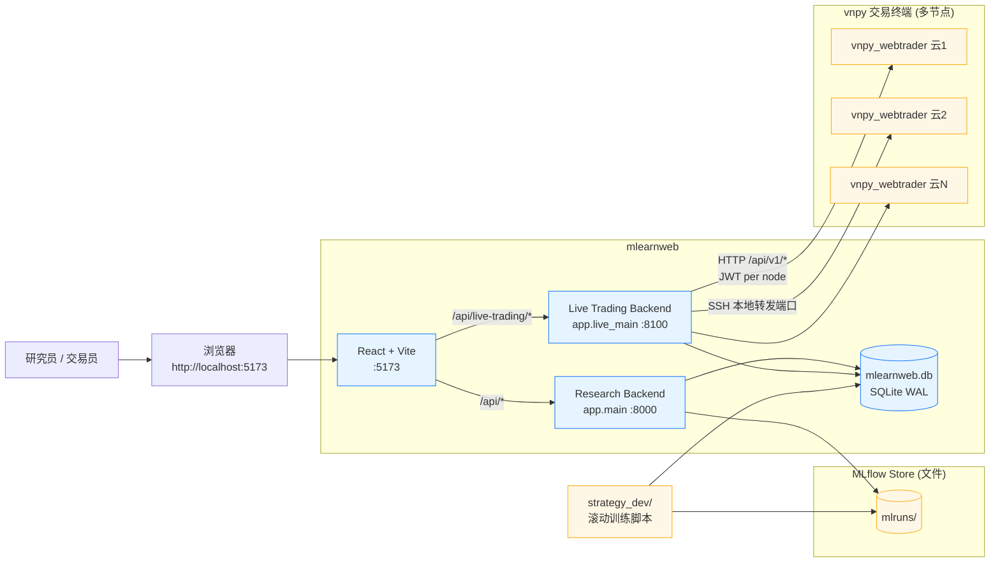

### 3.2 容器级架构（Level 2 - Container）

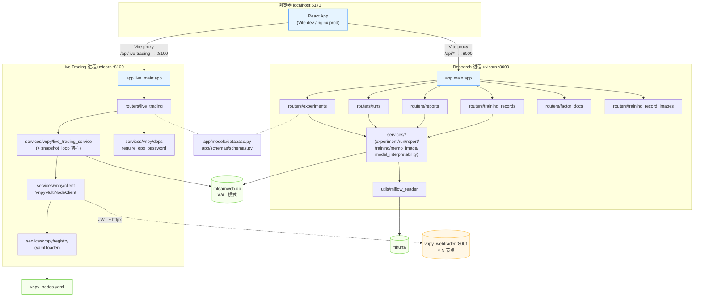

### 3.3 前后端通信拓扑

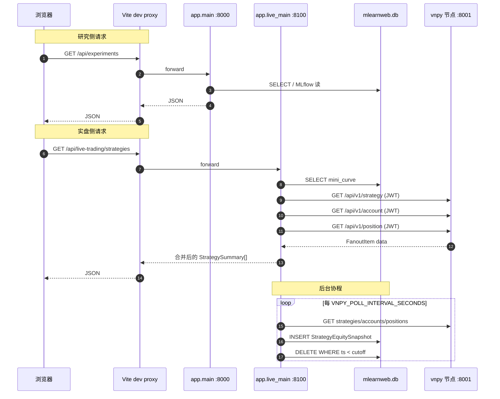

### 3.4 为什么双进程

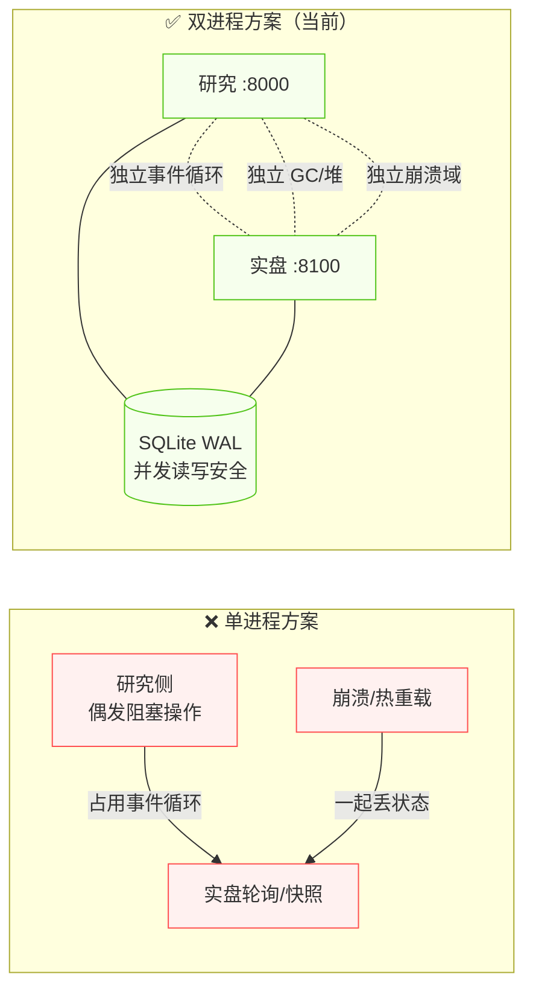

---

## 4. 后端详细设计

### 4.1 目录结构

```
mlearnweb/backend/
├── app/
│   ├── main.py                      # 研究侧入口 (:8000)
│   ├── live_main.py                 # 实盘侧入口 (:8100)
│   ├── core/
│   │   └── config.py                # pydantic-settings
│   ├── models/
│   │   └── database.py              # SQLAlchemy ORM + WAL pragma
│   ├── schemas/
│   │   └── schemas.py               # Pydantic 请求/响应模型
│   ├── routers/
│   │   ├── experiments.py           # MLflow 实验
│   │   ├── runs.py                  # MLflow run
│   │   ├── reports.py               # 回测报告
│   │   ├── training_records.py      # 训练记录 CRUD
│   │   ├── training_record_images.py
│   │   ├── factor_docs.py           # 因子文档
│   │   └── live_trading.py          # 实盘（仅被 live_main 加载）
│   ├── services/
│   │   ├── experiment_service.py
│   │   ├── run_service.py
│   │   ├── report_service.py
│   │   ├── training_service.py
│   │   ├── memo_image_service.py
│   │   ├── model_interpretability_service.py
│   │   └── vnpy/                    # ✦ 实盘子包（仅被 live_main 加载）
│   │       ├── __init__.py
│   │       ├── registry.py
│   │       ├── client.py            # _PerNodeClient + VnpyMultiNodeClient
│   │       ├── live_trading_service.py
│   │       └── deps.py              # require_ops_password
│   └── utils/
│       └── mlflow_reader.py         # 直接读取 mlruns/ 文件
├── vnpy_nodes.yaml                  # 节点注册（.gitignore）
├── vnpy_nodes.yaml.example          # 模板
├── mlearnweb.db                     # SQLite
└── requirements.txt
```

### 4.2 统一响应格式

所有路由（研究侧 + 实盘侧）返回同一形状：

```python
class ApiResponse(BaseModel):
    success: bool = True
    message: str = ""
    data: Any = None
```

实盘侧在此基础上扩展 `LiveTradingListResponse`（`message` 改名为 `warning` 的语义：非阻断性告警，UI 显示黄色 banner）。

分页统一为 `{total, page, page_size, items}` 落在 `data` 里。

### 4.3 数据库：SQLite WAL 模式

通过 SQLAlchemy 的 `connect` 事件统一启用 WAL：

```python
@event.listens_for(engine, "connect")
def _enable_sqlite_wal(dbapi_conn, _):
    cur = dbapi_conn.cursor()
    cur.execute("PRAGMA journal_mode=WAL;")
    cur.execute("PRAGMA synchronous=NORMAL;")
    cur.close()
```

WAL 是数据库文件级的持久设置，任一进程建立连接即生效。这样：

- 研究侧大查询不阻塞实盘侧 INSERT
- 实盘侧 INSERT 不阻塞研究侧读
- 训练脚本（strategy_dev/）也安全并发

### 4.4 研究侧请求链路

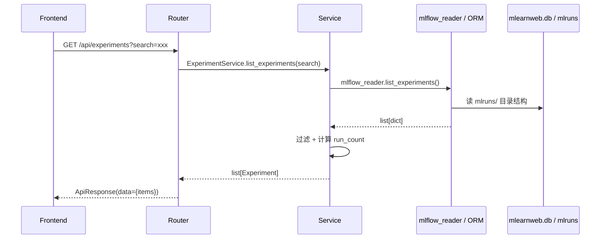

研究侧严格执行 **Router → Service → Model/Utils** 三层：

- **Router** 只做 HTTP 解析、Dependency 注入、异常包装
- **Service** 做业务逻辑、数据聚合、事务控制
- **Model/Utils** 做 ORM 或 MLflow 文件系统访问

### 4.5 实盘侧架构

#### 4.5.1 模块分工

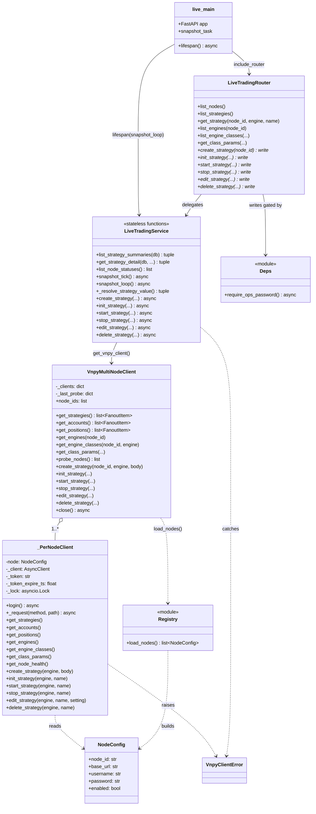

#### 4.5.2 lifespan 与快照协程

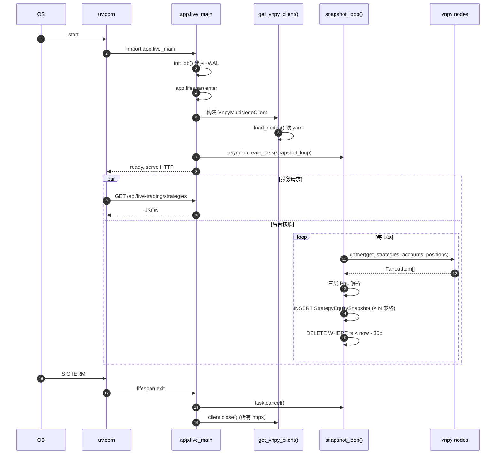

#### 4.5.3 三层 PnL 口径解析

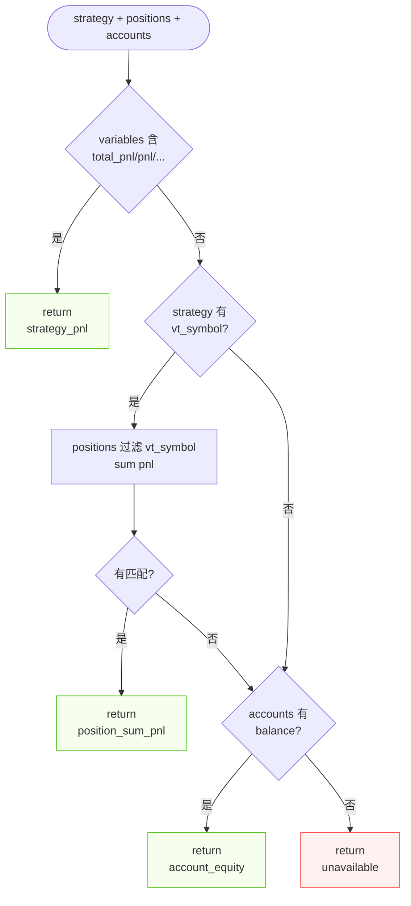

每层命中即返回，`source_label` 字段明确标注口径，前端图表标题按它切换文案：

| source_label | 图表标题 | 使用场景 |
|---|---|---|
| `strategy_pnl` | 策略收益 (variables) | 策略子类自己声明了 PnL 字段 |
| `position_sum_pnl` | 持仓浮动盈亏 | 单品种 CTA 策略 |
| `account_equity` | 账户权益（多策略共享） | 多品种策略，无法归属 |
| `unavailable` | 收益曲线（暂无数据） | 所有源都失败 |

#### 4.5.4 fanout 合成

```python
async def _fanout(self, method_name: str) -> list[FanoutItem]:
    async def _one(nid, client):
        try:
            data = await getattr(client, method_name)()
            return {"node_id": nid, "ok": True, "data": data, "error": None}
        except Exception as e:
            return {"node_id": nid, "ok": False, "data": [], "error": str(e)}
    return await asyncio.gather(*(_one(nid, c) for nid, c in self._clients.items()))
```

**两个关键特性**：

1. **部分失败不沉没整体请求**：某节点挂掉只会返回 `ok=False`，service 层据此生成 `warning` 字段，前端 UI 继续渲染其他节点。
2. **形状稳定**：无论 1 个还是 N 个节点，service 层拿到的都是 `list[FanoutItem]`，业务代码无需区分。

#### 4.5.5 JWT 管理与 401 重试

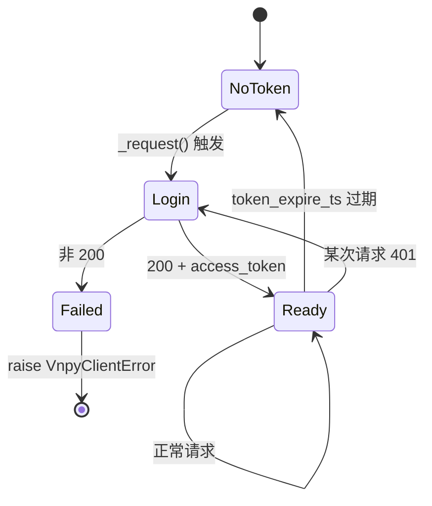

token 过期时间默认 vnpy 给 30 分钟，客户端提前 5 分钟失效（`time.time() + 25*60`）避免边界情况。遇到 401 先登录重试一次，第二次仍失败才抛出。

#### 4.5.6 运维口令守卫

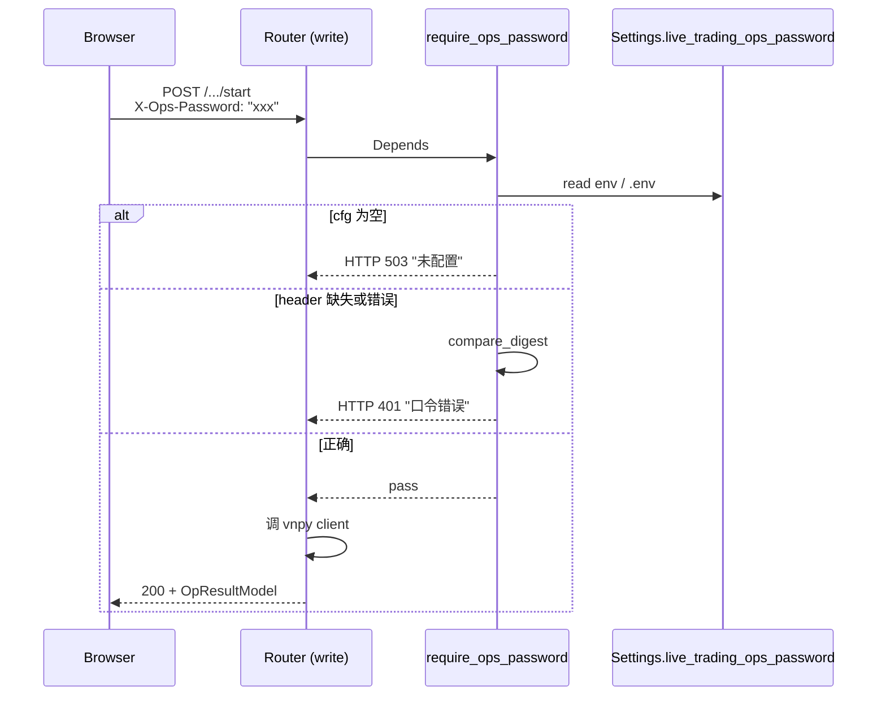

实现要点：
- `secrets.compare_digest` 防止 timing 攻击
- 单密码共享，**不是真正的用户鉴权**；适用于"只允许知情者操作"的场景
- 日志不记录密码字面值
- 只挂在写路由上 (`dependencies=[Depends(require_ops_password)]`)，读路由无需口令

### 4.6 路由清单

**研究侧** (`app.main:app`)：

| 方法 | 路径 | 说明 |
|---|---|---|
| GET | `/api/experiments` | 实验列表 |
| GET | `/api/experiments/{exp_id}` | 实验详情 |
| GET | `/api/experiments/{exp_id}/summary` | 状态统计 |
| GET | `/api/runs` | 实验下 run 分页 |
| GET | `/api/runs/{run_id}` | run 详情 |
| GET | `/api/runs/{run_id}/report` | 回测完整报告 |
| GET/POST/PATCH/DELETE | `/api/training-records/...` | 训练记录 CRUD |
| POST | `/api/training-records/{id}/images` | 备忘录图片上传 |
| GET | `/api/factor-docs/*` | Alpha158/101/191 文档 |

**实盘侧** (`app.live_main:app`)：

| 方法 | 路径 | 口令 | 说明 |
|---|---|---|---|
| GET | `/api/live-trading/nodes` | — | 节点状态（探活） |
| GET | `/api/live-trading/strategies` | — | 跨节点策略汇总 |
| GET | `/api/live-trading/strategies/{node_id}/{engine}/{name}` | — | 策略详情 |
| GET | `/api/live-trading/nodes/{node_id}/engines` | — | 节点引擎列表 |
| GET | `/api/live-trading/nodes/{node_id}/engines/{engine}/classes` | — | 引擎下可用策略类 |
| GET | `/api/live-trading/nodes/{node_id}/engines/{engine}/classes/{class_name}/params` | — | 策略类默认参数 |
| POST | `/api/live-trading/strategies/{node_id}` | ✓ | 新建策略 |
| POST | `/api/live-trading/strategies/{node_id}/{engine}/{name}/init` | ✓ | 初始化 |
| POST | `/api/live-trading/strategies/{node_id}/{engine}/{name}/start` | ✓ | 启动 |
| POST | `/api/live-trading/strategies/{node_id}/{engine}/{name}/stop` | ✓ | 停止 |
| PATCH | `/api/live-trading/strategies/{node_id}/{engine}/{name}` | ✓ | 编辑参数 |
| DELETE | `/api/live-trading/strategies/{node_id}/{engine}/{name}` | ✓ | 删除 |

---

## 5. 前端详细设计

### 5.1 目录结构

```
mlearnweb/frontend/src/
├── App.tsx                          # 路由注册 + React Query Provider + antd ConfigProvider
├── main.tsx
├── components/
│   ├── layout/
│   │   ├── AppLayout.tsx
│   │   └── Header.tsx               # 顶部导航（含实盘菜单项）
│   └── MemoPopover/
├── pages/
│   ├── TrainingRecordsPage.tsx      # 默认主页
│   ├── TrainingDetailPage.tsx
│   ├── HomePage.tsx                 # 实验列表
│   ├── ExperimentDetailPage.tsx
│   ├── ReportPage.tsx
│   ├── FactorDocsPage.tsx
│   ├── help/
│   │   ├── HelpLayout.tsx
│   │   └── Alpha*/ FactorCategories
│   └── live-trading/                # ✦ 实盘模块（独立边界）
│       ├── LiveTradingPage.tsx
│       ├── LiveTradingStrategyDetailPage.tsx
│       └── components/
│           ├── MiniEquityChart.tsx
│           ├── FullEquityChart.tsx
│           ├── PositionsTable.tsx
│           ├── NodeStatusBar.tsx
│           ├── StrategyActions.tsx
│           ├── StrategyCreateWizard.tsx
│           └── StrategyEditModal.tsx
├── services/
│   ├── apiClient.ts                 # 单例 axios，baseURL /api
│   ├── experimentService.ts
│   ├── runService.ts
│   ├── reportService.ts
│   ├── trainingService.ts
│   ├── trainingImageService.ts
│   ├── factorDocService.ts
│   └── liveTradingService.ts        # ✦ 实盘服务
├── hooks/
│   └── useOpsPassword.ts            # ✦ 写操作口令 Modal + 401 重试
└── types/
    ├── index.ts                     # 研究侧类型
    └── liveTrading.ts                # ✦ 实盘类型（独立文件）
```

### 5.2 三层前端模型

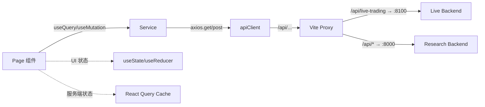

- **Page**：组织布局、取数、路由、交互；用 `useQuery` 读、`useMutation` 写（或实盘模块直接通过 `useOpsPassword.guardWrite`）
- **Service**：薄封装 axios 请求 + 类型化返回；实盘 service 还额外注入 `X-Ops-Password` 头
- **apiClient**：单例 axios，`baseURL: "/api"`，全局错误日志拦截器

### 5.3 React Query 约定

- 全局 `staleTime: 5 * 60 * 1000`, `retry: 1`
- 研究侧多数 query 依赖手动 `refetch()`
- 实盘侧使用 `refetchInterval` 实现轮询：
  - 汇总页 strategies 5s
  - 详情页 strategy 3s
  - 节点状态 nodes 10s
- queryKey 约定：
  - `['experiments', search]`
  - `['experiment', expId]`
  - `['runs', expId, page, pageSize]`
  - `['live-nodes']`
  - `['live-strategies']`
  - `['live-strategy', nodeId, engine, name]`

### 5.4 Vite 代理分发

```ts
server: {
  proxy: {
    '/api/live-trading': { target: 'http://127.0.0.1:8100' },  // 先于 /api
    '/api':              { target: 'http://127.0.0.1:8000' },
    '/uploads':          { target: 'http://127.0.0.1:8000' },
  },
}
```

> **注意顺序**：Vite 按注册顺序做前缀匹配，`/api/live-trading` 必须先于 `/api` 声明，否则会被后者吞掉。

### 5.5 前端页面路由

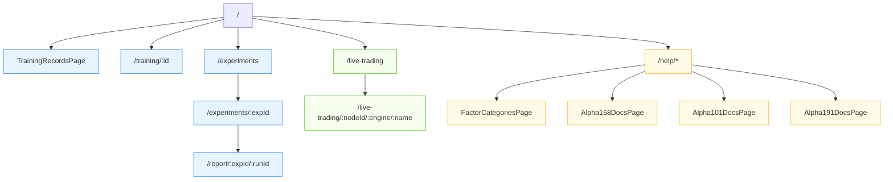

### 5.6 实盘模块组件组合

```mermaid
graph TD
    subgraph LiveTradingPage
        TopBar[标题 + 刷新 + 新建按钮]
        Status[NodeStatusBar]
        Grid[StrategyCard 栅格]
    end
    Grid --> Card1[StrategyCard]
    Card1 --> Mini[MiniEquityChart]
    Card1 --> Action1[StrategyActions compact]
    TopBar --> Wizard[StrategyCreateWizard]

    subgraph LiveTradingStrategyDetailPage
        DHeader[Header + Tags + Badge]
        DAction[StrategyActions]
        Tab1[Tab 收益曲线+持仓]
        Tab2[Tab 策略监控 Empty]
    end
    Tab1 --> Full[FullEquityChart]
    Tab1 --> PosTbl[PositionsTable]
    DHeader --> DAction
    DAction --> EditModal[StrategyEditModal]

    StrategyActions[StrategyActions<br/>&#40;shared&#41;] --> GuardWrite[useOpsPassword.guardWrite]
    Wizard --> GuardWrite
    EditModal --> GuardWrite
    GuardWrite --> SecretModal[OpsPasswordModal]

    classDef shared fill:#fff7e6,stroke:#faad14
    class StrategyActions,GuardWrite,SecretModal shared
```

### 5.7 写操作口令流程

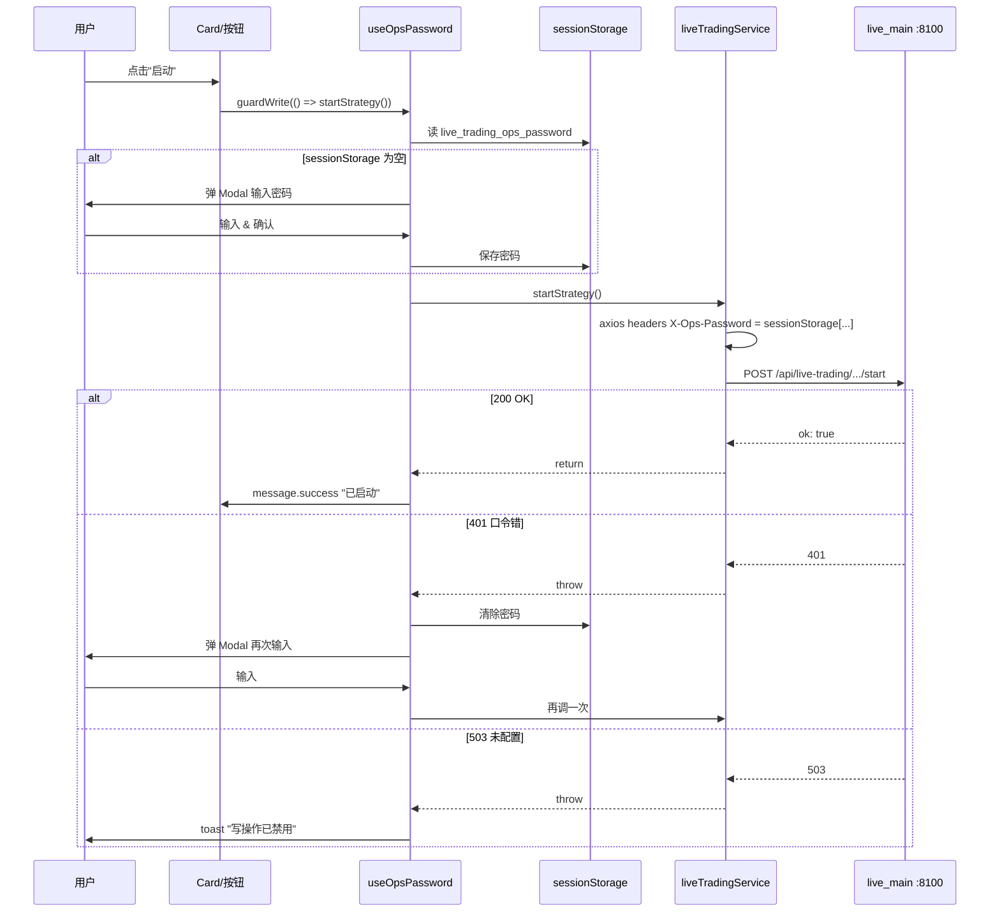

---

## 6. 数据模型

### 6.1 ER 图

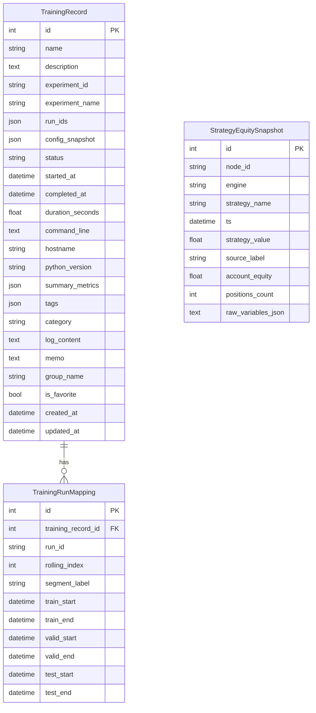

### 6.2 关键模型细节

#### TrainingRecord

- `config_snapshot`：训练启动时 `config.py` 序列化快照，供后续复现
- `run_ids`：关联到 MLflow 的 run id 列表（滚动训练通常多个）
- `summary_metrics`：Sharpe / MaxDD / AnnReturn 等汇总
- `log_content`：训练标准输出（可选持久化）
- `group_name` + `is_favorite`：UI 分组与收藏

#### StrategyEquitySnapshot

- **身份键**：`(node_id, engine, strategy_name, ts)` — 联合索引 `ix_ses_identity_ts`
- **双列存值**：`strategy_value`（按口径选出的一个值）+ `account_equity`（始终记录），便于未来切换口径而不迁表
- **raw_variables_json**：每个 tick 的 `variables` 原样 JSON，用于事后调试
- **保留期**：默认 30 天，`snapshot_tick` 每次在写入后按 `ts < now - retention_days` 批量 DELETE

### 6.3 vnpy 上游数据契约

这些不是 mlearnweb 的表，但是 `VnpyMultiNodeClient` 的输入/输出形状：

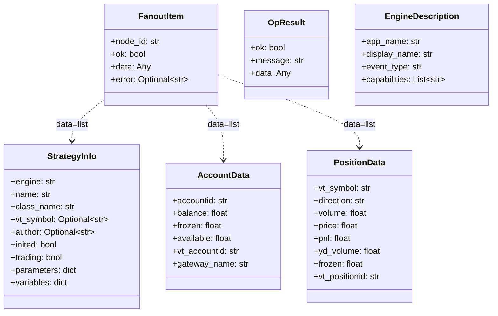

---

## 7. 核心功能原理

### 7.1 训练记录与滚动回测报告

```mermaid
flowchart LR
    subgraph Offline["离线流程"]
        TS["strategy_dev/<br/>tushare_*_rolling_train.py"]
        RG[RollingGen 切分数据]
        TR[TrainerRM 多期并行]
        SR[SignalRecord]
        PR[PortAnaRecord]
        SA[SHAPAnalysisRecord]
        TR --> SR
        TR --> PR
        TR --> SA
        TS --> RG
        RG --> TR
        TR --> |_record_training_to_dashboard| SQ[(mlearnweb.db<br/>training_records)]
        TR --> MLRuns[(mlruns/)]
    end

    subgraph Online["mlearnweb 在线展示"]
        FE[TrainingRecordsPage]
        TS_API[/api/training-records]
        TS_SVC[TrainingService]
        RP[ReportPage]
        RP_API[/api/runs/&lbrace;id&rbrace;/report]
        RP_SVC[ReportService]
        MLR[mlflow_reader]
        FE --> TS_API --> TS_SVC --> SQ
        RP --> RP_API --> RP_SVC --> MLR --> MLRuns
    end
```

- 训练脚本在滚动每期结束后把关键信息写入 SQLite（`TrainingService.create_record` + `TrainingRunMapping`）
- 前端读这张表得到索引，点击某条后用 `ReportPage` 通过 `mlflow_reader` 直接读对应 run 的 artifacts（IC、持仓、收益曲线、SHAP pkl 等）
- `mlflow_reader` 不依赖 mlflow server，直接解析 `mlruns/<exp_id>/<run_id>/` 文件，避免引入额外服务

### 7.2 模型解释性（SHAP）

- 滚动训练期间，`SHAPAnalysisRecord` 对每个 LightGBM 模型用 TreeExplainer 算特征贡献，序列化到 artifacts/shap_analysis.pkl
- `model_interpretability_service.py` 加载 pkl 并计算：
  - 全局特征重要性（mean(|shap|)）
  - 单行样本的逐特征贡献
- 前端 `ReportPage` 用 ECharts 柱状图 + 折线图展示

### 7.3 实盘策略监控链路

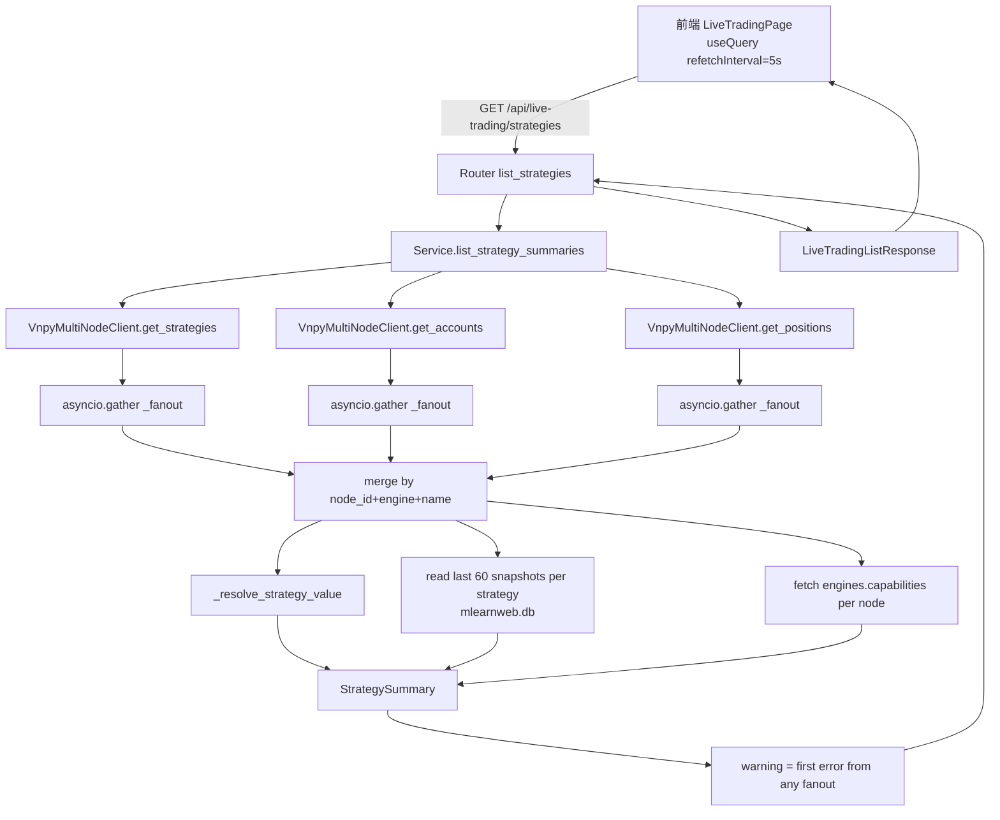

### 7.4 实盘策略写操作链路

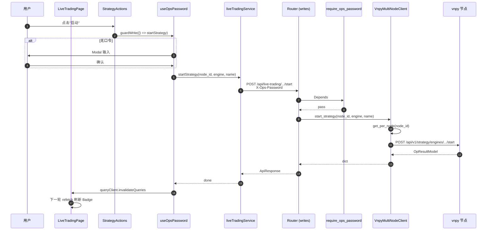

### 7.5 新建策略向导

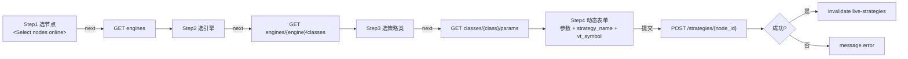

参数表单通过运行时 `typeof defaultValue` 推断组件：

- `boolean` → `<Switch>`
- `number` → `<InputNumber>`
- 其他 → `<Input>`

### 7.6 历史收益曲线

```mermaid
flowchart LR
    subgraph Writer["实盘进程 :8100"]
        SL[snapshot_loop 每 10s]
        FT[_fanout strategies/accounts/positions]
        PR[_resolve_strategy_value]
        INS[INSERT StrategyEquitySnapshot]
        DEL[DELETE WHERE ts < now-30d]
        SL --> FT --> PR --> INS --> DEL
    end

    subgraph Reader["前端轮询路径"]
        FE[LiveTradingPage 5s]
        DT[LiveTradingStrategyDetailPage 3s]
        GS[GET /strategies<br/>读最近 60 点]
        GD[GET /strategies/.../detail<br/>读 window_days=7]
    end

    SQ[(strategy_equity_snapshots)]
    INS --> SQ
    GS --> SQ
    GD --> SQ
    FE --> GS
    DT --> GD
```

> 两进程读写同一 SQLite，靠 WAL 模式保证并发安全。

---

## 8. 关键技术细节

### 8.1 为什么选 SQLite WAL 而不是 PostgreSQL

- 项目部署在开发机/个人工作站，无运维团队，SQLite 零运维胜出
- WAL 模式允许多个 OS 进程并发读写，满足"双 uvicorn + 训练脚本"场景
- 数据量小（训练记录 ~百条、快照 30 天 ~百万行），SQLite 单文件完全够
- 未来需要迁 PG 时只需换 `database_url` 并删 WAL pragma，SQLAlchemy 抽象已经到位

### 8.2 为什么 vnpy 客户端直连而不是用 vnpy_aggregator

- `vnpy_aggregator` 是独立进程，需要另起 Python 环境、维护自己的 yaml、暴露二层鉴权
- 在选项 A（本地 aggregator + SSH 隧道）下，它只是多一层进程而不带来任何隔离收益
- `_fanout` 的核心逻辑就是 `asyncio.gather`，在 mlearnweb 侧实现成本低
- 未来如果运维模型变化（例如要把聚合层部署到公网主机），可在 `VnpyMultiNodeClient` 加 `upstream_mode="direct"|"agg"` 开关兼容

### 8.3 双 uvicorn 的共享依赖处理

- 两个 FastAPI app 都 `import` 同一份 `app/core/config.py`、`app/models/database.py`、`app/schemas/schemas.py`
- 各自 `init_db()` 都会触发 `Base.metadata.create_all`，对已有表是 no-op，对新增表（`strategy_equity_snapshots`）谁先起就谁建
- 共享 `Settings` 实例里配置，但进程级隔离（一个进程改 env 不会影响另一个）
- 运行时之间**没有**共享全局变量或锁；所有交互都走 SQLite
- `get_vnpy_client()` 的单例仅限于 live_main 进程；app.main 即使意外 import 也不会触发构建（因为只有 live_main 的 lifespan 才 eager 初始化）

### 8.4 ssession 生命周期

- 请求内 session：FastAPI `Depends(get_db_session)` 创建一个新的 `SessionLocal()`，请求结束关闭
- 快照协程 session：`snapshot_tick` 内部 `SessionLocal()`，短事务立即 commit 然后 close，不跨 tick 持有

### 8.5 httpx AsyncClient 单例与关闭

- `_PerNodeClient` 持有自己的 `httpx.AsyncClient`（而不是全局共享一个），这样每个节点独立的 `base_url` 不冲突
- 单例仅存活于 live_main 进程的 lifespan 期间：startup 创建，shutdown 统一 `close()`
- 连接复用：httpx 底层 transport 自动做 keep-alive，N 个节点轮询不会每次新建 TCP

### 8.6 错误分级与前端提示

| 场景 | 后端行为 | 前端呈现 |
|---|---|---|
| 某节点不可达 | 读接口 `warning` 非空 `data` 仅含可达节点 | 黄色 Alert 可关闭 |
| 所有节点不可达 | 读接口 `warning` 非空、`data = []` | 红色 Alert + 历史快照仍可见 |
| vnpy 返回 4xx/5xx | 写接口透传，`raise HTTPException` | `message.error(detail)` |
| 运维口令未配置 | 写接口 503 | toast "写操作已禁用" |
| 口令错误 | 写接口 401 | 清除 sessionStorage + 重弹 Modal |
| 后端进程崩溃 | 前端 axios 网络错误 | React Query 自动重试 1 次 |

### 8.7 时间戳与时区

- 后端传给前端统一用**毫秒级 Unix 时间戳** (`int(time.time() * 1000)`)
- 数据库里的 `ts` 用 `datetime.utcnow()`，读出来时转 `ts * 1000`
- 前端用 dayjs 做 `fromNow()` / `format()`，根据浏览器本地时区显示

### 8.8 URL 编码与复合身份

策略身份是 `(node_id, engine, strategy_name)`，其中 `strategy_name` 允许包含 `.`、空格、中文等字符。为避免 React Router 路径匹配歧义：

- 前端 `encodeURIComponent` 三段分别编码再拼
- 后端 FastAPI path 参数默认 url-decode，得到原始值

### 8.9 前端性能

- React Query 自动缓存相同 queryKey 的响应，避免同一页面多组件重复请求
- `refetchInterval: 0` 在详情页切到 Tab 2 时不停掉——但因为数据量小且 Tab 2 是 Empty，影响可忽略
- ECharts 每次 render 用 `useMemo` 的场景不多（当前实现没走 memo，策略数 ≤ 20 时 fps 稳定）
- Vite 5 的 HMR 只在 `app.main:8000` 热重载时触发，不影响 `:8100`

---

## 9. 部署与运维

### 9.1 本地开发拓扑

```mermaid
graph TB
    Dev[开发机 Windows]
    subgraph Dev
        V[Vite :5173] --> B1[app.main :8000]
        V --> B2[app.live_main :8100]
        B1 --> DB[(mlearnweb.db)]
        B2 --> DB
        B2 --> VW[vnpy_webtrader :8001<br/>本地]
    end
    B1 --> MLR[(mlruns/)]
```

一键启动：
```bat
start_mlearnweb.bat E:\ssd_backup\Pycharm_project\python-3.11.0-amd64\python.exe
```
一键停止：
```bat
stop_mlearnweb.bat
```

### 9.2 多节点生产拓扑（推荐）

```mermaid
graph TB
    Dev[研究工作站]
    subgraph Dev
        Browser --> V[Vite / nginx]
        V -.->|:/api/live-trading| LB[app.live_main :8100]
        V -.->|/api/*| RB[app.main :8000]
        RB & LB --> DB[(SQLite WAL)]
        LB --> T1[autossh :18001]
        LB --> T2[autossh :18002]
    end

    subgraph Cloud1
        N1[vnpy_webtrader :8001]
    end
    subgraph Cloud2
        N2[vnpy_webtrader :8001]
    end

    T1 -.->|SSH tunnel| N1
    T2 -.->|SSH tunnel| N2
```

SSH 隧道常驻（autossh）：
```bash
autossh -fN -M 0 -L 18001:127.0.0.1:8001 user@cloud1
autossh -fN -M 0 -L 18002:127.0.0.1:8001 user@cloud2
```

`vnpy_nodes.yaml`：
```yaml
nodes:
  - node_id: cloud1
    base_url: http://127.0.0.1:18001
    username: vnpy
    password: vnpy
  - node_id: cloud2
    base_url: http://127.0.0.1:18002
    username: vnpy
    password: vnpy
```

### 9.3 环境变量（`.env`）

| 变量 | 默认 | 说明 |
|---|---|---|
| `MLRUNS_DIR` | `F:\Quant\code\qlib_strategy_dev\mlruns` | MLflow 文件存储路径 |
| `VNPY_NODES_CONFIG_PATH` | `./vnpy_nodes.yaml` | vnpy 节点注册文件路径 |
| `VNPY_REQUEST_TIMEOUT` | 10.0 | 单次 vnpy HTTP 超时(秒) |
| `VNPY_POLL_INTERVAL_SECONDS` | 10 | 快照协程 tick 间隔 |
| `VNPY_SNAPSHOT_RETENTION_DAYS` | 30 | 历史快照保留天数 |
| `LIVE_TRADING_OPS_PASSWORD` | 空 | 运维口令；留空则禁用所有写操作 |

### 9.4 进程与端口清单

| 服务 | 端口 | 启动命令 |
|---|---|---|
| 前端 dev | 5173 | `npm run dev` |
| 研究后端 | 8000 | `uvicorn app.main:app --reload` |
| 实盘后端 | 8100 | `uvicorn app.live_main:app --reload` |
| vnpy_webtrader (各节点) | 8001（节点本机回环） | `uvicorn vnpy_webtrader.web:app` |
| SSH 隧道（多节点） | 18001+ | `autossh -fN -M 0 -L ...` |

---

## 10. 可观测与测试

### 10.1 测试金字塔

```mermaid
graph TB
    U[单元测试<br/>_resolve_strategy_value / registry 加载] --> I[集成测试<br/>TestClient + FakeVnpyClient]
    I --> E[端到端手测<br/>真实 vnpy :8001]

    classDef u fill:#e6f4ff
    classDef i fill:#f6ffed
    classDef e fill:#fff7e6
    class U u
    class I i
    class E e
```

### 10.2 pytest 套件

- `tests/test_backend/test_api_integration.py` — 研究侧 API
- `tests/test_backend/test_mlflow_reader.py` — MLflow 解析
- `tests/test_backend/test_live_trading.py` — **实盘侧**（18 用例）
  - `TestResolveStrategyValue` — 三层 PnL 回退 A/B/C/unavailable
  - `TestRegistry` — 正常 yaml / 缺失文件 / 格式错误
  - `TestReadEndpoints` — nodes / strategies / detail / engines / warning 降级
  - `TestWriteGuard` — 未配置 503 / 错误密码 401 / 正确密码 200 / 写入路由到 client
  - `TestSnapshot` — 写入 + 保留期清理

运行：
```bash
cd mlearnweb
python -m pytest tests/test_backend/ -v
```

当前状态：**49/49 passed**（31 既有 + 18 新增）。

### 10.3 日志与错误追踪

- 使用 Python `logging`，模块粒度 logger 名：`app.services.vnpy.client`、`app.services.vnpy.live_trading_service` 等
- `logger.warning` 用于部分失败（某节点挂掉）
- `logger.exception` 用于非预期错误（含 traceback）
- uvicorn 以 access log 记录每个请求

### 10.4 快照健康巡检

```sql
-- 查近 5 分钟有几条 snapshot，应约等于 (5*60 / VNPY_POLL_INTERVAL_SECONDS) × 活跃策略数
SELECT count(*)
FROM strategy_equity_snapshots
WHERE ts > datetime('now', '-5 minutes');

-- 每策略最近一次 tick
SELECT node_id, engine, strategy_name, max(ts), source_label, strategy_value
FROM strategy_equity_snapshots
GROUP BY 1, 2, 3;
```

---

## 11. 扩展路径

```mermaid
graph LR
    Now[当前实现] --> WS[WS 实时推送<br/>/api/v1/ws 订阅]
    Now --> NodeUI[节点管理 UI<br/>yaml→DB 表]
    Now --> OrderUI[订单/成交列表]
    Now --> Auth[多用户登录系统<br/>替换单密码守卫]
    Now --> Monitor[Tab2 策略监控<br/>日志流/风控告警]
    Now --> CrossNode[跨云 aggregator 进程<br/>upstream_mode="agg"]
    Now --> PG[SQLite→PostgreSQL<br/>如需扩容]
```

- **WebSocket**：`VnpyMultiNodeClient` 可为每节点维护一路 `/api/v1/ws?token=...`，service 层继续用当前接口；前端将 `refetchInterval` 换成订阅更新。
- **节点管理 UI**：把 `registry.py` 的 yaml 后端换成 `vnpy_nodes` 表 + `/api/live-trading/nodes` 写路由，加一个"节点管理"子页即可。
- **订单 / 成交**：`_PerNodeClient` 已预留 `get_orders`/`get_trades`/`cancel_order` 能力（未在当前 UI 使用），后续加一个 Tab 或抽屉即可接入。
- **多用户登录**：把 `X-Ops-Password` 换成 JWT + 角色；研究侧共用同一套即可。
- **Tab 2 策略监控**：目前 `<Empty>`，候选内容：实时日志流、风控告警、当日成交流水、绩效指标（Sharpe / MaxDD 等在快照历史足够时）。
- **跨云聚合**：引入 `VNPY_UPSTREAM_MODE="direct"|"agg"`，`agg` 模式下走 `vnpy_aggregator/agg/*` 统一入口；service 层零改动。
- **PostgreSQL 迁移**：`database_url` 改 `postgresql+asyncpg://...`，删 WAL pragma listener，SQLAlchemy 其它代码几乎不动。

---

## 附录 A · 参考文件索引

**后端**
- [app/main.py](../backend/app/main.py)
- [app/live_main.py](../backend/app/live_main.py)
- [app/core/config.py](../backend/app/core/config.py)
- [app/models/database.py](../backend/app/models/database.py)
- [app/schemas/schemas.py](../backend/app/schemas/schemas.py)
- [app/routers/live_trading.py](../backend/app/routers/live_trading.py)
- [app/services/vnpy/registry.py](../backend/app/services/vnpy/registry.py)
- [app/services/vnpy/client.py](../backend/app/services/vnpy/client.py)
- [app/services/vnpy/live_trading_service.py](../backend/app/services/vnpy/live_trading_service.py)
- [app/services/vnpy/deps.py](../backend/app/services/vnpy/deps.py)

**前端**
- [src/App.tsx](../frontend/src/App.tsx)
- [vite.config.ts](../frontend/vite.config.ts)
- [src/components/layout/Header.tsx](../frontend/src/components/layout/Header.tsx)
- [src/hooks/useOpsPassword.ts](../frontend/src/hooks/useOpsPassword.ts)
- [src/services/liveTradingService.ts](../frontend/src/services/liveTradingService.ts)
- [src/types/liveTrading.ts](../frontend/src/types/liveTrading.ts)
- [src/pages/live-trading/LiveTradingPage.tsx](../frontend/src/pages/live-trading/LiveTradingPage.tsx)
- [src/pages/live-trading/LiveTradingStrategyDetailPage.tsx](../frontend/src/pages/live-trading/LiveTradingStrategyDetailPage.tsx)

**测试**
- [tests/test_backend/test_live_trading.py](../tests/test_backend/test_live_trading.py)

**运维脚本**
- [start_mlearnweb.bat](../../start_mlearnweb.bat)
- [stop_mlearnweb.bat](../../stop_mlearnweb.bat)

**配置模板**
- [vnpy_nodes.yaml.example](../backend/vnpy_nodes.yaml.example)

---

## 附录 B · 术语表

| 术语 | 含义 |
|---|---|
| **node** | 一个 vnpy_webtrader 进程实例，对应一台交易服务器 |
| **engine** | vnpy 策略引擎（如 `CtaStrategy`、`SignalStrategyPlus`） |
| **strategy** | 策略实例，由 `(node_id, engine, name)` 复合身份唯一标识 |
| **FanoutItem** | `{node_id, ok, data, error}`，多节点响应合成格式 |
| **source_label** | 策略收益曲线的数据来源口径：`strategy_pnl` / `position_sum_pnl` / `account_equity` / `unavailable` |
| **capabilities** | vnpy 引擎支持的操作子集：`add/edit/init/remove/start/stop` |
| **ops password** | 单密码运维口令，仅保护写操作，非多用户鉴权 |
| **WAL** | SQLite Write-Ahead Logging，允许多进程并发读写 |
| **snapshot** | `StrategyEquitySnapshot` 表的一行，记录某策略某时刻的 `strategy_value`/`account_equity`/持仓数等 |
| **fanout** | 并发调用 N 个上游节点，把结果合并成统一列表的模式 |
## 实盘事件中台与风险事件

`app.live_main` 在原有 `snapshot_loop` / `ml_snapshot_loop` 基础上新增实盘事件中台：

- `LiveTradingEvent` 是后端到前端的 SSE invalidation 事件，只包含 `event_type`、策略身份、`severity`、`reason`、`query_groups` 和时间戳。
- `StrategyRiskEvent` 是前端展示用风险事件，由 `risk_event_service` 从 strategy variables、orders、node/gateway health 实时计算，并与 `live_trading_events` 表中的历史事件合并返回。
- SSE endpoint 为 `/api/live-trading/events`。它不推送收益曲线、成交、持仓、ML 指标等大对象，避免把后端与 React Query key 或前端展示结构耦合。
- 前端 `useLiveTradingInvalidations()` 将 query group 映射到 `liveTradingRefresh.ts` 中的 query key，并调用 React Query `invalidateQueries`。
- SSE connected 时，策略详情页卡片关闭独立高频轮询；SSE disconnected 时启用低频 fallback polling，保证最终一致。
- P2 后 `ws_collector_service.py` 连接每个 vnpy 节点 `/api/v1/ws?token=...`，处理 `strategy/order/trade/position/account/log` topic；WS 在线节点暂停 REST fingerprint 热路径，断线节点自动恢复 REST fallback。
- P3 后 `live_trading_event_store.py` 写入 `live_trading_events` 表，支持 dedupe、历史过滤、`ack_at/ack_by`。风险确认由 `POST /api/live-trading/risk-events/{event_id}/ack` 完成，并受 ops password 保护。

Query group 映射：

| group | 典型刷新目标 |
| --- | --- |
| `strategy_detail` | 策略详情、参数、持仓、曲线 |
| `performance_summary` | 指标总览 |
| `trades` | 成交与订单相关视图 |
| `risk_events` | 顶部风险 Alert、风险事件卡片、列表风险角标 |
| `ml_latest` | 最新 TopK、最新预测 summary |
| `ml_metrics` | ML history / rolling 指标 |
| `history_dates` | 历史持仓日期、历史预测日期 |
| `corp_actions` | 当前持仓相关除权事件 |
| `strategy_list` | 实盘策略列表 |
| `nodes` | 节点在线状态 |

前端仍不直接连接 vnpy WS；所有实时来源都先进入 `app.live_main` 的事件中台，再由 SSE 推送 invalidation。
