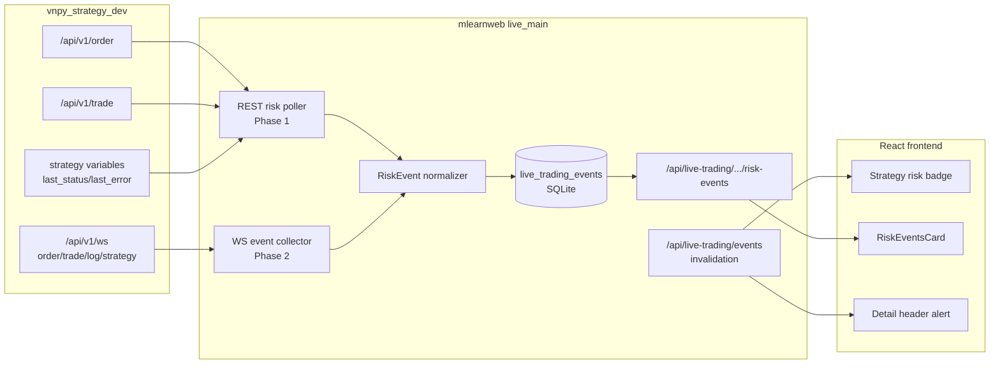

# 实盘异常可见性评估与分阶段路线图

## Summary

本计划独立于部署路线图和刷新体验计划。目标是解决 mlearnweb 实盘交易前端对 vnpy 侧异常可见性不足的问题，包括策略运行异常、撮合异常、拒单、撤单、撤单再报、网关离线、策略日志错误等。

结论：当前 mlearnweb 已能展示一部分 ML 策略运行状态，例如 `last_status`、`last_error`、`replay_status`，但没有把订单状态、撮合日志、撤单再报和策略日志建成统一的“风险事件”能力。两个仓库的现状已经具备较好的数据基础，最优路径不是让前端直接连每个 vnpy 节点，而是在 mlearnweb live 后端做事件归一、持久化和告警分级，再向前端提供稳定 API/SSE。

## 当前实现扫描

### vnpy 侧已具备的信号源

| 信号源 | 所在仓库/模块 | 当前能力 | 可用性 |
| --- | --- | --- | --- |
| 订单 REST | `vnpy_webtrader/web.py` 的 `/api/v1/order` | 返回当前订单，包含 `vt_orderid`、`status`、`status_msg`、`reference` 等字段 | 可立即用于 mlearnweb REST 轮询 |
| 成交 REST | `vnpy_webtrader/web.py` 的 `/api/v1/trade` | 返回当前成交；mlearnweb 已用 orders 的 `reference` 反查策略归因 | 已接入，但只展示成交，不展示异常订单 |
| WebSocket 事件 | `vnpy_webtrader/web.py` 的 `/api/v1/ws` | 广播 `order`、`trade`、`position`、`account`、`log`、`strategy` topic | 可作为第二阶段事件驱动来源 |
| 策略状态 | `vnpy_ml_strategy/template.py` | `last_status`、`last_error`、`replay_status`、`last_run_date` 等写入 strategy variables | mlearnweb 已读取，但告警展示仍偏弱 |
| 策略日志 | `write_log()` | 写入 vnpy `EVENT_LOG`，webtrader 会转为 WS `log` topic | 未被 mlearnweb 持久化 |
| 模拟柜台撮合状态 | `vnpy_qmt_sim/td.py` | 能产生 `Status.REJECTED`、`Status.CANCELLED`、`PARTTRADED`、`status_msg`，也会写拒单/撮合阻塞日志 | mlearnweb 尚未归一为风险事件 |
| 撤单再报标记 | `vnpy_ml_strategy/template.py` | order `reference` 采用 `{strategy_name}:{seq}`，重报时带 `R` 后缀 | 可从订单 reference 解析 |
| 节点健康 | `vnpy_webtrader/routes_node.py` / engine health | 可返回进程、事件队列、gateway 状态 | mlearnweb 已有 watchdog，但未与策略异常 UI 合并 |

### mlearnweb 侧当前缺口

| 区域 | 当前状态 | 缺口 |
| --- | --- | --- |
| 策略列表卡片 | 展示运行、初始化、权益、持仓数、`last_status` chip | 不能一眼看到“拒单 3 笔、撤单再报 1 笔、策略日志 ERROR” |
| 策略详情 | 有当前持仓、成交、收益曲线、指标总览、ML 监控 | 交易异常没有统一卡片或列表 |
| 成交记录 | `TradesCard` 只展示成交 | 拒单、撤单、未成交、部分成交、撮合阻塞都不会出现 |
| 后端 API | 有 `/trades`，无 `/orders` 或 `/risk-events` | 前端无数据源可展示订单异常 |
| 后台循环 | `snapshot_loop` 轮询策略/账户/持仓 | 不记录订单/日志事件，不支持断线期间事件追溯 |
| 告警 | watchdog 只关注节点 offline/recovery | 业务级策略异常和交易异常不告警 |

## 金融量化专家评估

实盘策略监控中，异常优先级不应按“技术错误是否抛异常”排序，而应按“是否可能导致真实交易风险或策略失真”排序。

| 优先级 | 场景 | 风险解释 | 推荐前端表现 |
| --- | --- | --- | --- |
| P0 | 网关断连、节点 offline、策略 trading 中但 `last_status=failed`、`replay_status=error` | 策略可能停止产生信号或交易端不可控 | 列表卡片红色角标 + 详情页顶部 Alert |
| P0 | 订单 `REJECTED`，尤其资金不足、持仓不足、涨跌停、合约错误 | 目标仓位无法达成，回测/实盘偏离会快速扩大 | 策略卡片显示拒单计数，详情展示订单原因 |
| P0 | 连续撤单再报失败或重报次数超阈值 | 可能陷入追单/风控循环，带来交易成本和敞口风险 | 风险事件置顶，支持阈值告警 |
| P1 | 部分成交长时间未补齐、订单超时撤单、撮合价格缺失 | 实际仓位和目标仓位偏离，影响收益曲线归因 | 展示为 warning，关联 vt_orderid/reference |
| P1 | 策略日志出现关键字：`failed`、`异常`、`拒绝下单`、`撮合阻塞` | 可能未反映在策略变量或订单状态里 | 进入事件列表，按 severity 分类 |
| P2 | 普通 info 日志、正常撤单、正常成交 | 需要审计，但不应打扰实盘主视图 | 默认折叠或仅在事件页展示 |

核心原则：

- 拒单/撤单/重报是交易风险，不是普通日志。它们必须和收益曲线、持仓处在同等监控层级。
- 成交不是订单链路的全集。只看成交会天然漏掉“没成交的失败”。
- 对 ML 策略，`last_status=ok` 只代表推理/产物阶段健康，不代表 09:26 下单和 09:30 撮合成功。
- 对双轨策略，实盘和模拟节点的异常需要保留 `node_id`、`gateway_name`、`mode`，不能只按策略名合并。

## 软件架构专家评估

### 设计目标

1. 前端看到的是稳定的 mlearnweb 契约，而不是 vnpy 原始事件结构。
2. mlearnweb 后端负责跨节点认证、去重、归因、严重级别映射和持久化。
3. 第一阶段先复用现有 REST，低风险补齐“看得见”；第二阶段再接 vnpy WS，做到“来得快、可追溯”。
4. 不让浏览器直接连接每个 vnpy 节点，避免 token 暴露、跨域、连接数和多节点重连复杂度外溢到前端。

### 推荐架构

### 事件归一模型

建议新增 mlearnweb 内部模型 `LiveTradingEvent`，不要直接把 vnpy 原始 payload 暴露给前端。

| Field | Purpose |
| --- | --- |
| `id` | SQLite 主键 |
| `node_id` | vnpy 节点 |
| `engine` | 策略引擎，能识别时填写 |
| `strategy_name` | 从 strategy event 或 order `reference` 解析 |
| `gateway_name` | 订单/成交/日志携带时填写 |
| `event_type` | `strategy_status` / `order` / `trade` / `log` / `node` / `gateway` |
| `severity` | `info` / `warning` / `error` / `critical` |
| `status` | 订单状态、策略状态或节点状态 |
| `vt_orderid` | 订单链路主键 |
| `vt_tradeid` | 成交主键 |
| `vt_symbol` | 标的 |
| `reference` | `{strategy_name}:{seq}`，重报可能带 `R` |
| `message` | 给前端展示的短文本 |
| `raw_json` | 原始 payload，便于排错 |
| `dedupe_key` | 幂等去重，如 `node:vt_orderid:status` |
| `created_at` | mlearnweb 入库时间 |
| `event_ts` | vnpy 事件时间或 mlearnweb 接收时间 |
| `ack_at` / `ack_by` | 后续人工确认用，可 P2 实现 |

### 归因规则

| 原始数据 | 归因方式 |
| --- | --- |
| order | 优先解析 `reference` 前缀 `{strategy_name}:`；`R` 后缀标记为 resubmit |
| trade | 通过 `vt_orderid` 找 order，再用 order `reference` 归因 |
| strategy event | 直接使用 payload 中的 `strategy_name` 和 WS `engine` |
| log | 优先解析 `[{strategy_name}]`；解析失败则作为节点/网关级事件 |
| node health | 节点级事件，不强行归因到策略 |

### Severity 映射建议

| 条件 | Severity |
| --- | --- |
| node offline / gateway disconnected | `critical` |
| strategy `last_status=failed` 或 `replay_status=error` | `error` |
| order `status=REJECTED` / `拒单` / `ORDER_JUNK` | `error` |
| 同策略同标的 N 分钟内多次 `REJECTED` 或重报失败 | `critical` |
| order `CANCELLED` 且 `reference` 带重报链路 | `warning` |
| order `PARTTRADED` 超过阈值仍未终态 | `warning` |
| log 包含 `异常`、`failed`、`拒绝`、`撮合阻塞` | `warning` 或 `error`，按关键词细分 |
| 正常 `ALLTRADED` / 普通 info log | `info` |

## 分阶段计划

### Phase 1：REST 轮询补齐异常可见性

目标：不改 vnpy 仓库，不引入长连接，先让前端能看到拒单、撤单、部分成交、策略失败等关键信号。

| 优先级 | 任务 | 说明 | 验收 |
| --- | --- | --- | --- |
| P0-1 | 新增 `GET /api/live-trading/strategies/{node_id}/{engine}/{name}/orders` | mlearnweb 从目标节点 `/api/v1/order` 拉订单，按 `reference` 前缀过滤策略订单 | 能返回该策略 rejected/cancelled/parttraded/alltraded 订单 |
| P0-2 | 新增后端订单异常归一函数 | 输出 `severity`、`is_rejected`、`is_cancelled`、`is_resubmit`、`status_msg`、`risk_reason` | 单测覆盖拒单、撤单、重报 reference |
| P0-3 | 前端新增 `StrategyRiskSummary` | 策略列表卡片显示 P0/P1 异常计数；详情页顶部 Alert 显示最新高危异常 | 用户不用进成交表也能看到拒单/策略失败 |
| P0-4 | 详情页新增 `OrderEventsCard` 或 `RiskEventsCard` | 放在“策略监控”或专门“事件/风控”区域，不和历史持仓设计冲突 | 能查看订单状态、原因、reference、时间 |
| P1-1 | 把 `last_status=failed`、`last_error`、`replay_status=error` 统一纳入风险事件 | 目前只在 cron strip 弱展示，需成为统一风险信号 | 列表和详情均可见 |
| P1-2 | 增加风险事件刷新策略 | 先用 3-5 秒轮询，复用 `liveTradingRefresh.ts` query key/invalidation | 启停/编辑/手动刷新后同步刷新 |
| P2-1 | 增加阈值配置 | 如“连续拒单 N 次升级 critical”“部分成交超 M 分钟 warning” | 默认值保守，可后续 UI 化 |

### Phase 2：mlearnweb 接入 vnpy WebSocket，形成可追溯事件流

目标：从“定时看到异常”升级为“vnpy 有事件就尽快入库并通知前端刷新”。

| 优先级 | 任务 | 说明 | 验收 |
| --- | --- | --- | --- |
| P1-1 | live_main 后台维护每个 vnpy 节点的 WS 连接 | 复用 `_PerNodeClient` 登录 token，连接 `/api/v1/ws?token=...` | 节点重启后自动重连 |
| P1-2 | 新增 `live_trading_events` 表 | 持久化 order/trade/log/strategy/node 事件，支持 dedupe | 断线重连后能查看近期事件 |
| P1-3 | 新增 `GET /risk-events` API | 支持按 node/engine/strategy/severity/time 查询 | 前端无需直接处理原始 WS |
| P1-4 | 新增 SSE invalidation | mlearnweb 向浏览器推送 query invalidation，而不是直接推完整业务对象 | 订单事件到达后前端主动刷新相关 query |
| P2-1 | 增加事件确认/过滤 | 用户可按 severity、类型、已确认过滤 | 降低运维噪声 |
| P2-2 | 接入通知 | critical 事件可邮件/企业微信/飞书通知 | 不影响主交易链路 |

### Phase 3：vnpy 侧增强事件语义

目标：减少 mlearnweb 通过字符串和 reference 猜测，提升事件质量。

| 优先级 | 任务 | 仓库 | 说明 |
| --- | --- | --- | --- |
| P2-1 | webtrader 增加 `/api/v1/log` 或事件历史 ring buffer | `vnpy_strategy_dev` | mlearnweb 重启后可补拉短期日志 |
| P2-2 | order payload 显式携带 `strategy_name`、`resubmit_count`、`risk_reason` | `vnpy_ml_strategy` / `vnpy_qmt_sim` | 减少 reference 解析依赖 |
| P2-3 | AutoResubmitMixin 暴露统计变量 | `vnpy_order_utils` / `vnpy_ml_strategy` | 如 `reject_count`、`cancel_count`、`resubmit_count`、`last_order_error` |
| P3-1 | 撮合异常标准化 | `vnpy_qmt_sim` | 将“撮合阻塞”“无法解析成交价”等输出为结构化 risk event |

## UI 放置建议

- 策略列表卡片：只放紧凑风险角标和最高 severity，不展示长日志。
- 策略详情顶部：出现 P0/P1 风险时显示 Alert，说明最新异常和数量。
- 策略详情页签：建议新增“事件/风控”页签，或放入既有“策略监控”页签内。历史持仓既然设计在“策略监控”页签，本计划不改变该位置。
- 成交记录卡片：继续只展示成交；不要把拒单塞进成交表，以免混淆“trade”和“order event”的金融语义。

## Test Plan

后端：

- 构造 fake vnpy orders，覆盖 `REJECTED`、`CANCELLED`、`PARTTRADED`、`ALLTRADED`。
- 构造 reference：`strategy:1`、`strategy:2R`、其他策略前缀，验证过滤和重报识别。
- 构造 `status_msg` 包含资金不足、持仓不足、撮合阻塞，验证 severity/risk_reason。
- 构造 strategy variables：`last_status=failed`、`replay_status=error`，验证风险事件输出。
- 后续 WS 阶段验证重连、去重、入库和断线恢复。

前端：

- 策略列表出现风险角标，且不破坏右键新标签页打开策略详情。
- 策略详情顶部显示 P0/P1 Alert。
- `RiskEventsCard` 空数据时降级为“暂无风险事件”。
- 订单异常刷新不影响收益曲线、历史持仓、ML 监控现有位置。
- 执行 `cmd /c npm run build`。

回归：

- 执行 `python -m pytest tests/test_backend -q`。
- 对接 fake webtrader，模拟拒单和撤单再报，检查 UI 可见。

## 风险与注意

- vnpy WS 当前不持久化，mlearnweb 第二阶段必须自己入库，否则断线期间事件仍会丢。
- order `reference` 是当前最实用的策略归因方式，但它是约定而非强类型字段，长期应由 vnpy 侧显式补 `strategy_name`。
- 只看当前 `/api/v1/order` 可能拿不到历史很久的订单，第一阶段适合“当前会话异常可见”，长期审计要靠事件表或 vnpy 侧历史接口。
- alert 需要阈值和确认机制，否则多策略、多节点时容易产生告警疲劳。
- 前端不要直接连每个 vnpy 节点 WS，认证、重连、fanout、去重和安全边界应留在 mlearnweb 后端。

## 当前结论

推荐先实施 Phase 1。它能利用两个仓库已经存在的订单 REST、策略变量和 reference 归因能力，快速补齐用户最关心的拒单、撤单、重报、策略失败可见性。Phase 2 再接入 vnpy WebSocket，形成事件驱动刷新和事件持久化。Phase 3 最后回到 vnpy 仓库补强事件语义，降低 mlearnweb 的解析和猜测成本。
